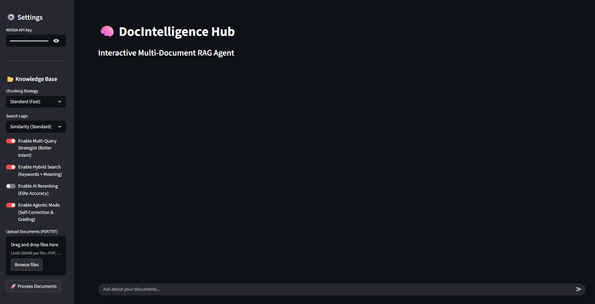

# 🧠 Agentic RAG Hub

A production-grade, interactive Multi-Document Retrieval-Augmented Generation (RAG) agent built with **LangGraph**, **Streamlit**, and **NVIDIA NIMs**. 

This application goes beyond standard RAG pipelines by implementing a **Self-Correcting Cognitive Architecture**. It actively grades retrieved documents, transforms queries if information is missing, and prevents hallucinations, ensuring elite accuracy.

---

## ✨ Key Features

- **🤖 Agentic Workflow (LangGraph):** Implements a self-reflective cycle (`Retrieve -> Grade -> Generate/Transform`) to ensure only highly relevant context is used.
- **⚡ Hybrid Search:** Combines semantic vector similarity with BM25 keyword matching for superior document retrieval.
- **🎯 AI Reranking:** Integrates `FlashrankRerank` to re-order retrieved chunks, pushing the most accurate data to the top.
- **🔄 Multi-Query Strategist:** Automatically translates user intent into multiple optimized search queries to capture broader context.
- **🛡️ Rate-Limit Resilient:** Built-in dynamic fallbacks and exponential backoff mechanisms to handle API throttling gracefully.
- **📊 Interactive UI:** A sleek, dark-themed Streamlit dashboard with real-time toggle controls for all advanced AI parameters.

---

## 📸 Preview



---

## 🛠️ Tech Stack

- **Frontend:** Streamlit
- **Orchestration:** LangChain & LangGraph
- **LLM & Embeddings:** NVIDIA NIM (`meta/llama-3.1-70b-instruct`) & HuggingFace (`all-MiniLM-L6-v2`)
- **Vector Database:** ChromaDB
- **Retrievers:** Contextual Compression, Ensemble Retriever, BM25

---

## 🚀 Getting Started

### Prerequisites
1. Python 3.9+
2. An NVIDIA API Key (Get one from [NVIDIA Build](https://build.nvidia.com/))

### Installation
1. Clone the repository:
   ```bash
   git clone https://github.com/vivekyadav-3/Agentic-RAG-Hub.git
   cd Agentic-RAG-Hub
   ```
2. Install the required dependencies:
   ```bash
   pip install -r requirements.txt
   ```
3. Run the Streamlit application:
   ```bash
   streamlit run app.py
   ```

---

## 💡 How to Use the Advanced Features
1. **Upload Documents:** Drag and drop your PDFs or TXT files into the sidebar.
2. **Standard RAG:** Ask a question for blazing-fast vector retrieval.
3. **Agentic Mode:** Toggle on **Self-Correction & Grading** in the sidebar. Ask a trick question (e.g., asking about a topic not in the document) and watch the Agent reject irrelevant chunks and refuse to hallucinate!

---

## 👨‍💻 Author
**Vivek Yadav**  
[GitHub](https://github.com/vivekyadav-3) | [LinkedIn](https://linkedin.com/in/vivekyadavcs)
